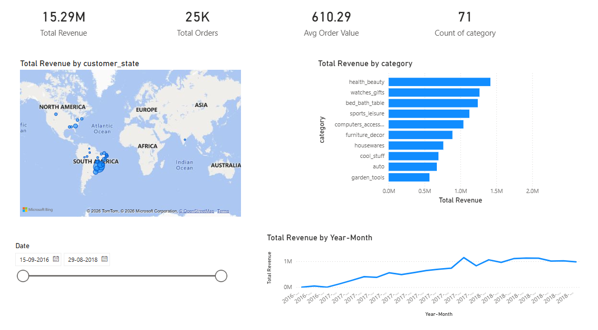
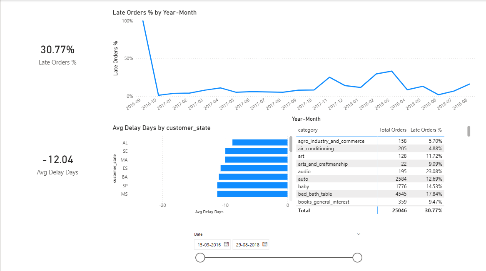
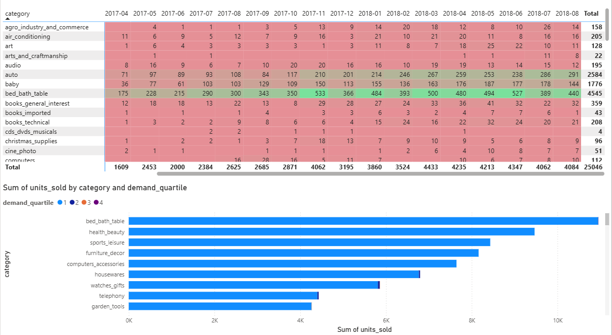

# 🛒 Olist E-Commerce Analytics & Inventory Optimization

## 📌 Project Overview
This project analyzes a real-world Brazilian e-commerce dataset (Olist) to uncover actionable insights regarding regional sales performance, delivery bottlenecks, and product demand. The end-to-end pipeline involves raw data ingestion, relational database modeling in PostgreSQL, complex SQL transformations, and interactive data visualization in Power BI.

---

## 🚀 The Dashboard 
*(Interactive Power BI Dashboard tracking KPIs, delivery SLAs, and demand quartiles)*

### 1. Sales & Revenue Overview
> Identifies top-performing states and high-revenue categories.

### 2. Delivery Bottlenecks
> Analyzes shipping SLA compliance to identify regions causing logistics failures.

### 3. Inventory & Demand Quartiles
> Heatmap tracking monthly units sold to isolate consistent top-tier inventory.

---

## 🛠️ Tech Stack & Methodology
* **Database Engine:** PostgreSQL (pgAdmin 4)
* **Data Modeling:** Star Schema, Primary/Foreign Key mapping, View creation
* **SQL Techniques:** Window Functions (`NTILE`, `OVER`), CTEs, Date/Time Math, Joins
* **BI Tool:** Power BI Desktop
* **DAX:** Time Intelligence, Calculate, Filter Context, Iterators (`AVERAGEX`)

---

## 📊 Key Business Insights
Based on the SQL queries and dashboard analysis:

1. **Revenue Concentration:** The platform generated a total revenue of **$15.29M** across **25K** total orders, with a heavy geographic concentration in the South East region (São Paulo map cluster) and **health_beauty** leading as the top revenue-generating category.
2. **Logistics Bottlenecks:** On average, packages arrive **12.04** days early overall. However, the total Late Orders rate sits at **30.77%**, with states like **AL** experiencing the narrowest delivery margins and categories like **audio** seeing high late-delivery rates (23.08%).
3. **Demand Stability:** Products in the **bed_bath_table** category consistently remained in the 1st Demand Quartile month-over-month, boasting the highest total units sold and representing a highly stable inventory investment.

---

## 💻 Data Architecture
Raw CSV files were imported into a localized PostgreSQL database. To optimize Power BI processing, a flattened master view (`vw_powerbi_master`) was engineered to join 6 localized tables before importing into the BI layer. 

*The original raw dataset is sourced from Kaggle's Brazilian E-Commerce Public Dataset by Olist.*
